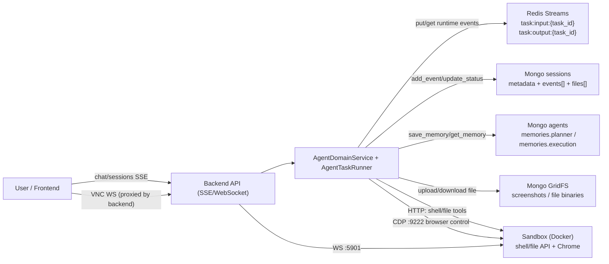
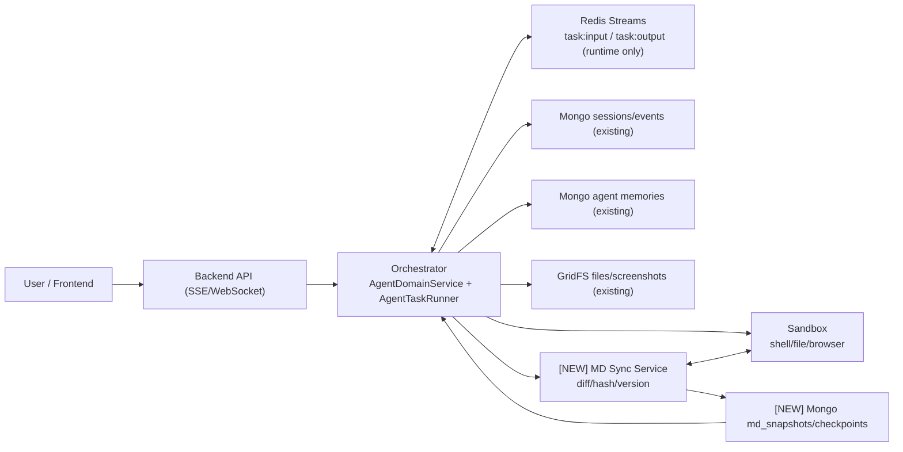

# ai-manus 引入 MD Scratchpad 的架构方案（中文）

## 1. 背景与目标

当前 `ai-manus` 的主干是：

- `Redis Stream`：实时输入/输出事件通道
- `Mongo sessions/events`：会话持久化历史
- `Mongo agents.memories`：Agent 上下文记忆
- `GridFS`：截图与文件二进制

该方案在多用户、审计、检索、恢复方面基础较好。  
本次目标不是替换现有主干，而是在保持主干不变的前提下，新增 `MD Scratchpad` 能力（例如 `task_plan.md / notes.md / heartbeat.md`），增强任务内可读性、可编辑性与恢复体验。

## 2. 现有架构（基线）

## 3. 目标架构（新增 MD Scratchpad）

## 4. 存储分工（避免重复）

### 4.1 Redis（不变）

- 仅作为实时事件通道
- 不作为长期历史真相源
- 不存会话级 `md` 历史

### 4.2 Sandbox MD（新增）

- 作为任务内工作记忆与协作介质
- 建议文件：
  - `task_plan.md`
  - `notes.md`
  - `heartbeat.md`

### 4.3 Mongo（不变 + 新增集合）

- 保持：
  - `sessions/events` 历史
  - `agent memories`
  - `GridFS` 文件
- 新增：
  - `session_md_snapshots`
  - `session_checkpoints`

## 5. 最小新增集合设计

### 5.1 session_md_snapshots

建议字段：

- `session_id`
- `version`
- `file_name`
- `content`
- `hash`
- `created_at`

### 5.2 session_checkpoints

建议字段：

- `session_id`
- `md_version`
- `last_event_id`
- `status`
- `created_at`

## 6. 任务恢复流程（断点续跑）

1. 创建新的 sandbox 实例
2. 读取最新 `checkpoint + md snapshots`
3. 回写 `task_plan.md / notes.md / heartbeat.md` 到 sandbox
4. 从 `last_event_id` 继续执行并向前端持续推送

## 7. 落地原则

1. `Redis = 实时通道`
2. `Mongo = 历史真相源`
3. `MD = 任务内工作记忆`

遵循以上三条，可同时获得：

- Manus 风格的文件化工作过程
- 企业级可追溯、可恢复、可审计能力
- 多实例与集群扩展能力

## 8. 当前 ai-manus 代码行为确认（2026-03-14）

以下为基于当前仓库代码的事实结论，供后续改造参考。

### 8.1 Sandbox 创建时机

- `create_session` 只创建 `session + agent`，不会立即创建 sandbox。
- 首次 `chat` 且进入 `_create_task` 时，才会创建或绑定 sandbox。
- 若 `session.sandbox_id` 已存在，则优先复用已有 sandbox。

结论：当前是“每个 session 复用一个 sandbox”，不是“每次执行创建新 sandbox”。

### 8.2 Sandbox 销毁时机

- `stop_session` 仅取消 task，并不会显式销毁 sandbox。
- `delete_session` 仅删除 Mongo 会话文档，也不会显式销毁 sandbox。
- 代码层的显式销毁主要在应用整体 shutdown 链路：
  `app shutdown -> AgentService.shutdown -> Task.destroy -> runner.destroy -> sandbox.destroy`。

### 8.3 TTL/超时机制

- backend 会把 `SERVICE_TIMEOUT_MINUTES` 注入 sandbox（默认 `sandbox_ttl_minutes=30`）。
- sandbox 侧中间件在收到 `/api/*` 请求时会自动续期（滑动窗口）。
- 因此不是固定“30分钟必删”，更接近“30分钟无 API 活动超时”。

### 8.4 历史回放数据来源

- 会话历史回放主数据来自 Mongo 的 `sessions.events`。
- 前端 `ChatPage/SharePage` 恢复历史时直接遍历 `session.events` 渲染。
- Browser 工具截图在事件中是文件存储签名 URL（来自文件服务），不依赖 sandbox 存活。

### 8.5 为什么停掉 sandbox 仍能看到历史内容

- 历史模式下（或非 live 工具视图），`shell/file/browser` 会直接使用 event 里的 `tool_content` 渲染。
- 仅在 live 模式下，前端才会调用 `/sessions/{id}/shell`、`/sessions/{id}/file` 或 VNC websocket 去读 sandbox 实时数据。

结论：sandbox 停掉后，历史回放仍可看；实时查看会失败。
