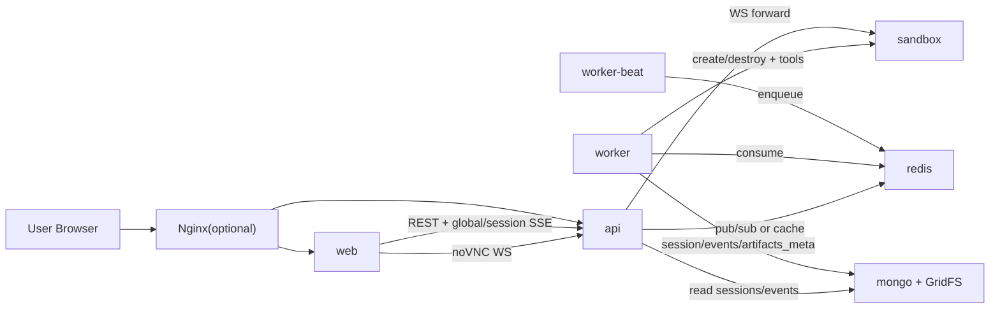
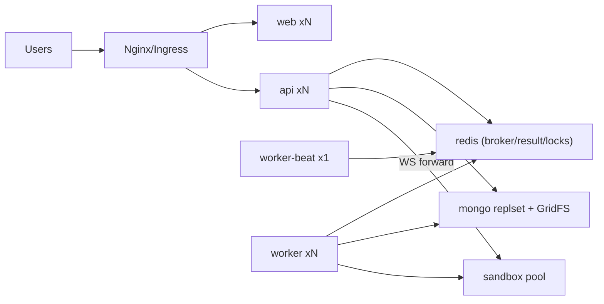

# 15 部署拓扑与部署文档（MVP）

## 状态
- 已冻结（MVP v1）。

## 目标
- 固化最小可运行部署形态：`web/api/worker/worker-beat/sandbox/redis/mongo`。
- 保证与前端、sandbox API 前后兼容。
- 支持后续平滑扩到多副本集群。

## 1. 服务清单（MVP）

1. `web`
- 职责：前端页面渲染、会话页、时间线、noVNC 入口。
- 扩缩容：可多副本。

2. `api`
- 职责：REST、SSE、鉴权、会话查询、noVNC WebSocket 转发。
- 扩缩容：可多副本（无状态）。

3. `worker`
- 职责：执行 Agent loop、调用工具、写事件流、管理 sandbox 生命周期。
- 扩缩容：可多副本（水平扩展执行能力）。

4. `worker-beat`
- 职责：定时扫描 Agent schedule 并投递队列。
- 扩缩容：单实例（避免重复触发）。

5. `sandbox`
- 职责：browser/shell/file 执行环境，提供 VNC 与工具 API。
- 扩缩容：MVP 单实例；后续按“每会话/每运行”策略扩展。

6. `redis`
- 职责：Celery broker + result backend + 运行态短期键（锁/令牌/心跳）。
- 扩缩容：MVP 单实例，后续可哨兵/集群。

7. `mongo`
- 职责：持久化会话、事件、Agent 配置、触发记录；GridFS 存二进制附件。
- 扩缩容：MVP 单实例，后续可副本集。

说明：
- `api/worker/worker-beat` 可使用同一个后端镜像，通过不同启动命令区分角色。
- MVP 不部署 `ssrf_proxy/squid`。

## 1.1 镜像与服务策略（冻结）

1. 单镜像策略
- 后端仅维护一个运行镜像（示例：`our-backend:<tag>`）。
- `api`、`worker`、`worker-beat` 共享该镜像，避免版本漂移。

2. 双服务策略（队列侧）
- `worker` 服务：执行队列任务（消费者）。
- `worker-beat` 服务：定时投递任务（调度器）。
- 两者必须是两个独立服务实例，不合并在同一进程。

3. 启动命令示例
- `api`: `uvicorn app.main:app --host 0.0.0.0 --port 8000`
- `worker`: `celery -A app.worker.celery_app worker -l INFO`
- `worker-beat`: `celery -A app.worker.celery_app beat -l INFO`

4. 副本策略
- `worker`: `replicas >= 1`，可按吞吐扩容。
- `worker-beat`: `replicas = 1`（或启用 leader lock 后再多副本）。

## 2. 部署拓扑图（单机）

## 3. 部署拓扑图（集群）

## 4. 关键链路

1. 调度执行链路
- `worker-beat -> redis -> worker -> sandbox -> mongo -> api(SSE) -> web`

2. 实时查看链路
- 全局摘要流（左侧）：`worker写session摘要事件 -> redis pubsub -> api fanout -> web`
- 会话详情流（中间）：`worker写session_events -> api按session_id fanout -> web`
- noVNC：`web -> api(ws转发) -> sandbox`
  - 映射约束：`api` 必须通过共享存储查询 `session_id -> sandbox_ws_target` 后再转发。
  - `worker` 负责维护映射写入与重建更新，禁止依赖 API 节点本地内存映射。

3. 历史回放链路
- `web -> api -> mongo/gridfs`（不依赖 sandbox 在线）

## 5. 启动顺序与健康检查

1. 启动顺序
- `redis,mongo -> sandbox -> api -> worker -> worker-beat -> web`

2. 健康检查最小项
- `api /health`
- `worker` 心跳（Celery inspect/ping）
- `worker-beat` 最近 tick 时间
- `sandbox` supervisor 与 tool API 健康
- `mongo/redis` 连通与延迟

## 6. 扩缩容规则（冻结）

1. 可以横向扩容
- `web`
- `api`
- `worker`

2. 保持单实例
- `worker-beat`（若多实例必须加分布式 leader lock）

3. 容量瓶颈优先级
- 先扩 `worker`（吞吐）
- 再扩 `api`（SSE/WS连接数）
- 最后扩 `sandbox`（并发执行密度）

## 7. 安全边界（MVP）

1. 当前不启用 `ssrf_proxy/squid`，属于已知安全缺口。
2. 上线前必须限制 sandbox 出网范围（VPC/ACL/防火墙）。
3. 预留代理环境变量位，后续可无缝接入 `ssrf_proxy`。
4. 模型密钥管理：
   - `model_profiles.api_key` 必须加密后入库（明文不落库）。
   - 部署需提供加密主密钥来源（KMS 或环境注入主密钥）。
   - 应用日志禁止打印 `api_key` 与密文字段。

## 8. 部署验收

1. 自动任务可由 `worker-beat` 投递并被 `worker` 消费执行。
2. 前端可实时接收 SSE，并可通过 noVNC 查看 sandbox。
3. sandbox 销毁后，历史回放仍可从 `mongo/gridfs` 查看。
4. 增加 `worker` 副本后吞吐提升，业务语义不变。
5. 同一后端镜像启动 `api/worker/worker-beat` 三角色，行为隔离且日志可区分。
