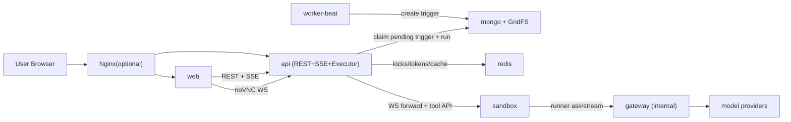
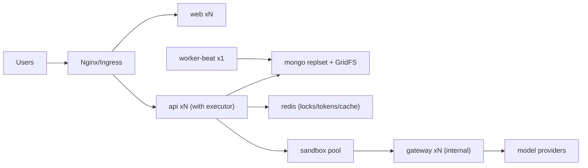

# 15 部署拓扑与部署文档（MVP）

## 状态
- 已冻结（MVP v2：API 合并执行器）。

## 目标
- 固化最小可运行形态：`web/api/worker-beat/gateway/sandbox/redis/mongo`。
- 去掉独立 `worker` 服务，执行面并入 `api`。
- 保持前端协议与 sandbox API 兼容。

## 1. 服务清单（MVP）
1. `web`
- 职责：前端页面、会话页、时间线、noVNC 入口。
- 扩缩容：可多副本。

2. `api`
- 职责：REST、SSE、鉴权、会话查询、noVNC 转发。
- 职责（新增）：内置执行器（Executor Loop），负责自动任务执行与事件写入。
- 扩缩容：可多副本（依赖 lease 防重）。

3. `worker-beat`
- 职责：定时扫描 Agent schedule 并创建 trigger（不执行业务步骤）。
- 扩缩容：单实例（避免重复触发）。

4. `gateway`
- 职责：LLM 中转、token 鉴权、限流、策略拦截、多模型路由、请求审计。
- 扩缩容：可多副本（无状态）。

5. `sandbox`
- 职责：browser/shell/file 执行环境，提供 VNC 与工具 API。
- 扩缩容：按会话/任务弹性创建。

6. `redis`
- 职责：调度锁、并发令牌、短期状态键（含 gateway token 状态）。
- 扩缩容：MVP 单实例，后续可哨兵/集群。

7. `mongo`
- 职责：持久化会话、事件、触发记录、配置；GridFS 存附件。
- 扩缩容：MVP 单实例，后续可副本集。

## 2. 部署拓扑图（单机）

## 3. 部署拓扑图（集群）

## 4. 关键链路
1. 调度执行链路
- `worker-beat -> trigger(mongo) -> api executor -> sandbox -> gateway -> model providers`

2. 实时查看链路
- `api/sandbox -> mongo(session_events) -> api(SSE) -> web`
- noVNC：`web -> api(ws转发) -> sandbox`

3. 历史回放链路
- `web -> api -> mongo/gridfs`（不依赖 sandbox 在线）

## 5. 启动顺序与健康检查
1. 启动顺序
- `redis,mongo -> gateway -> sandbox -> api -> worker-beat -> web`

2. 健康检查最小项
- `api /health`（含执行器心跳）
- `worker-beat` 最近 tick 时间
- `sandbox` supervisor 与 tool API
- `gateway /internal/v1/gateway/health`
- `mongo/redis` 连通与延迟

## 6. 扩缩容规则（冻结）
1. 可横向扩容
- `web`
- `api`
- `gateway`

2. 单实例
- `worker-beat`（多实例需 leader lock）

3. 容量瓶颈优先级
- 先扩 `api`（执行吞吐 + SSE）
- 再扩 `sandbox`（执行密度）
- 再扩 `gateway`（推理吞吐）

## 7. 安全边界（MVP）
1. sandbox 出网策略按进程区分：
- 浏览器进程允许访问外部业务网站。
- runner/脚本进程仅允许访问内部 `gateway`。
2. `gateway` 仅 internal 可达，不对公网暴露。
3. 模型密钥仅 gateway 可见，日志禁止明文。

## 8. 部署验收
1. 自动任务由 `worker-beat` 触发并由 `api` 内置执行器执行。
2. 前端可实时收到 SSE，并可通过 noVNC 查看 sandbox。
3. sandbox 销毁后，历史回放仍可从 `mongo/gridfs` 查看。
4. 扩 `api` 副本后吞吐提升，且无重复执行（lease + 幂等生效）。
5. sandbox 内 runner 只能通过 gateway 推理，直连模型厂商失败。
