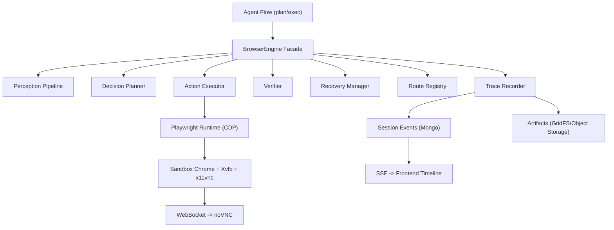
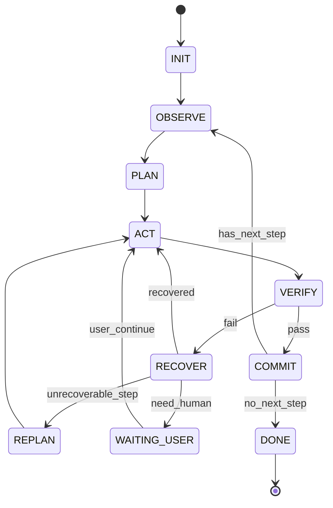

# 17 BrowserEngine 统一决策层设计（完整方案）

## 状态
- 待评审。

## 配套文档
- API Schema：
  - [17-browser-engine-api-schema.md](/Users/zuos/code/github/ai-manus/md/modules/api-schema/17-browser-engine-api-schema.md)
- 开发任务清单：
  - [17-browser-engine-dev-tasks.md](/Users/zuos/code/github/ai-manus/md/modules/dev-tasks/17-browser-engine-dev-tasks.md)

## 目标
- 构建独立 `BrowserEngine`，作为浏览器自动化统一决策层，解决“多步骤、动态页面、复杂表单、跨页跳转”不稳定问题。
- 保持与现有 `ai-manus` 前端时间线、右侧 `noVNC`、后端会话事件模型兼容。
- 支持“自动执行 + 人工接管 + 失败恢复 + 历史回放”闭环。

## 非目标
- 不替换现有 `sandbox`、`noVNC`、`session` 主模型。
- 不在本阶段引入新向量数据库或新流程引擎。
- 不在本阶段重写前端页面结构，仅做兼容扩展字段。

## 问题定义（现状）
- 现有浏览器工具以原子动作为主（click/input/scroll），缺少统一“动作后验证与恢复”。
- 动态菜单、延迟渲染、浮层遮挡、跨页跳转时，容易出现“动作成功但业务失败”。
- 复杂表单填写缺少字段依赖处理、提交前后校验、错误回填修复。
- 成功路径难复用，失败路径难复盘，工程化稳定性不足。

## 总体架构

## 设计原则
- 决策与执行分离：LLM 负责高层决策，执行器负责确定性动作。
- 每步必校验：无 `verify` 不进入下一步。
- 失败可恢复：先局部恢复，再重规划，最后人工接管。
- 成功可复放：成功路径沉淀为可回放路由，后续优先走确定性执行。
- 可观测与可审计：每步输入、动作、断言、恢复过程完整留痕。

## 模块分层

### 1) BrowserEngine Facade
- 职责：统一入口、生命周期控制、超时与取消控制。
- 输入：`goal`、`constraints`、`session_id`、`agent_id`。
- 输出：结构化任务结果、步骤轨迹、异常分类。

### 2) Perception Pipeline
- 数据源：
  - 交互元素清单（可见/可点/可编辑）
  - DOM摘要（裁剪后文本）
  - A11y树（role/name/state）
  - 页面截图、URL、标题、页面网络/控制台错误摘要
- 输出：标准化 `PageSnapshot` 与增量 `PageDiff`。

### 3) Decision Planner
- 将 `goal` 拆成可执行 `ActionPlan`：
  - `precondition`
  - `action`
  - `postcondition`
  - `fallback_policy`
- 支持模式：
  - `replay-first`（优先复放历史路线）
  - `agentic`（无可用路线时探索执行）

### 4) Action Executor
- 执行原子动作：`navigate/click/hover/input/select/press/wait/scroll/upload/download/switch_tab/switch_frame`。
- 执行基于 Locator 与 actionability，避免脆弱坐标点击。

### 5) Verifier
- 步骤完成判定：
  - 元素存在/可见/可操作
  - 文本命中
  - URL/路由变化
  - 表单校验通过
  - 业务成功标识出现（如创建成功提示）
- 输出：`verify_pass | verify_fail` + 证据。

### 6) Recovery Manager
- 恢复策略链（固定顺序）：
  - 重新定位元素
  - hover 展开菜单后重试
  - 滚动与聚焦修复
  - 换定位策略（A11y/文本/结构）
  - 局部重规划
  - 人工接管（`WAITING_USER`）
- 每次恢复需记录尝试次数与结果。

### 7) Route Registry
- 记录成功路线（`Route`）和失败样本（`FailureSignature`）。
- 版本化管理：站点变更后支持路线失效与重训练。

### 8) Trace Recorder
- 将执行轨迹写入会话事件与工件存储：
  - 动作前快照
  - 动作参数（脱敏）
  - 校验结果
  - 恢复链路
  - 最终结果

## 状态机设计

### 任务状态机

### 步骤状态
- `pending -> running -> verifying -> completed`
- 异常分支：`verifying -> recovering -> running | failed | waiting_user`

## 多页面与上下文域模型

### PageGraph
- 管理 `tab/frame` 关系与当前激活上下文。
- 每步动作显式绑定 `page_id/frame_id`，防止误操作到后台 tab。

### Domain 数据结构（建议）
- `BrowserTask`
  - `task_id, session_id, tenant_id, agent_id, goal, status, started_at, ended_at`
- `BrowserStep`
  - `step_id, task_id, seq, action, target, input, verify_rule, status, retries, error_code`
- `PageSnapshot`
  - `snapshot_id, task_id, step_id, page_id, url, title, dom_digest, a11y_digest, screenshot_ref`
- `RecoveryRecord`
  - `task_id, step_id, attempt_no, strategy, result, evidence`
- `Route`
  - `route_id, site_key, flow_key, version, steps, success_rate, last_validated_at`

## 复杂表单引擎（Form Orchestrator）
- 表单阶段：
  1. `Schema Discovery`：识别字段、约束、依赖关系。
  2. `Field Mapping`：将业务输入映射到字段。
  3. `Staged Fill`：分组填写（基础信息/可选项/附件）。
  4. `Validation Scan`：检测前端校验错误、必填缺失、格式错误。
  5. `Submit & Verify`：提交后验证业务成功信号。
- 特性：
  - 支持多页向导（wizard）
  - 支持动态字段显示/隐藏
  - 支持级联下拉框
  - 支持失败字段回填修复

## 定位与决策策略栈
- 定位优先级：
  1. 稳定属性（data-testid/aria-label/name）
  2. A11y（role + name + state）
  3. 文本语义匹配（近义词/语言变体）
  4. 结构定位（父子/邻接关系）
  5. 坐标兜底（仅最后手段）
- 动态菜单规则（强制）：
  - `hover(trigger) -> verify(expanded) -> click(menu_item) -> verify(postcondition)`

## 与现有 ai-manus 的集成点

### 后端接口层
- 在 `Browser` 协议上新增高阶入口：
  - `execute_goal(goal, constraints, context) -> ToolResult`
  - `execute_plan(plan) -> ToolResult`
  - `replay_route(route_id, inputs) -> ToolResult`
- 保留现有原子工具，作为 Engine 内部动作，不再由 Agent 直接拼接长链。

### Flow 层
- `ExecutionAgent` 不直接规划浏览器细粒度动作。
- 对浏览器类步骤仅产出业务目标，交给 `BrowserEngine` 执行并返回结构化结果。

### 事件层（兼容扩展）
- 在现有 `ToolEvent`/`StepEvent` 基础上扩展字段：
  - `phase`：`observe|plan|act|verify|recover|commit`
  - `attempt_no`
  - `verify_result`
  - `recover_strategy`
  - `route_id/route_version`
  - `page_id/frame_id`
- 前端未升级时可忽略扩展字段，不影响兼容。

## 存储与缓存设计

### Mongo（持久）
- `sessions`：继续作为主会话容器。
- 新增集合建议：
  - `browser_tasks`
  - `browser_steps`
  - `browser_snapshots`
  - `browser_routes`
  - `browser_recovery_records`
- 索引建议：
  - `(tenant_id, session_id, task_id)`
  - `(tenant_id, site_key, flow_key, version)`
  - `(tenant_id, status, updated_at)`

### Redis（运行态）
- 锁与并发：
  - `be:lock:session:{session_id}`
  - `be:token:tenant:{tenant_id}`
- 运行快照缓存：
  - `be:ctx:{task_id}`（短期上下文）
- 幂等键：
  - `be:idem:{task_id}:{step_seq}`

### Artifact
- 截图、HTML快照、长日志、下载文件使用 GridFS 或对象存储引用。
- 事件中只存 `artifact_ref`，避免 Mongo 文档膨胀。

## 可靠性与风控
- 超时分层：
  - `task_timeout`
  - `step_timeout`
  - `action_timeout`
  - `verify_timeout`
- 重试上限：
  - `action_retry_max`
  - `recovery_chain_max`
- 风控：
  - 域名白名单
  - 高风险动作确认（删除/支付/提交审批）
  - 凭据脱敏（输入日志只存掩码）

## 可观测性
- 关键指标：
  - 步骤成功率、恢复成功率、平均恢复次数
  - 表单提交成功率、跨页流程完成时长
  - 路由复放命中率、复放成功率
  - 人工接管率、接管后成功率
- 关键日志维度：
  - `tenant_id, group_id, agent_id, session_id, task_id, step_id, route_id`

## 错误码建议（BrowserEngine域）
- `BE-001` 元素未找到
- `BE-002` 元素不可操作
- `BE-003` 动作超时
- `BE-004` 校验失败
- `BE-005` 页面上下文丢失（tab/frame）
- `BE-006` 恢复链路耗尽
- `BE-007` 路由复放失败
- `BE-008` 风控阻断
- `BE-009` 需要人工接管
- `BE-010` 沙箱连接异常

## API 契约建议（后端内部/管理端）
- `POST /browser-engine/tasks`
  - 创建并执行浏览器任务（绑定 session）。
- `GET /browser-engine/tasks/{task_id}`
  - 查询任务状态与统计。
- `GET /browser-engine/tasks/{task_id}/steps`
  - 查询步骤明细与校验结果。
- `POST /browser-engine/tasks/{task_id}/resume`
  - 人工接管后恢复执行。
- `POST /browser-engine/routes/{route_id}/replay`
  - 执行路线复放。

## 迁移与落地计划（完整方案）

### Phase 0 架构落地
- 建立 `BrowserEngine` 包结构、接口、状态机、事件模型。
- 不改前端协议，仅后端新增字段可选输出。

### Phase 1 执行闭环
- 接通 `observe/act/verify/recover`。
- 接入动态菜单策略与统一重试。

### Phase 2 复杂表单
- 接入 `Form Orchestrator`、字段依赖、提交校验与回填修复。

### Phase 3 路由复放
- 增加 `Route Registry`，上线 replay-first 策略。
- 引入路线版本与失效回退。

### Phase 4 工程化增强
- 指标、告警、压测、风控策略完善。
- 增加跨站点稳定性基线测试。

## 验收标准（非MVP）
- 支持跨 3+ 页面流程，步骤成功率达标且可追溯。
- 动态菜单场景不再出现“点击成功但业务未推进”无感失败。
- 复杂表单支持字段依赖、提交校验、错误回填。
- 失败场景可恢复或明确进入人工接管，不出现长时间卡死无状态反馈。
- 历史回放可按步骤查看快照、断言、恢复轨迹。

## 开发前确认项
- 是否将 `BrowserEngine` 作为独立 python 包（建议）还是保留在 `backend/app/domain/services/browser_engine`。
- 是否优先支持中文站点语义匹配（建议是）。
- 是否开启默认 `replay-first`（建议按站点白名单逐步开启）。
