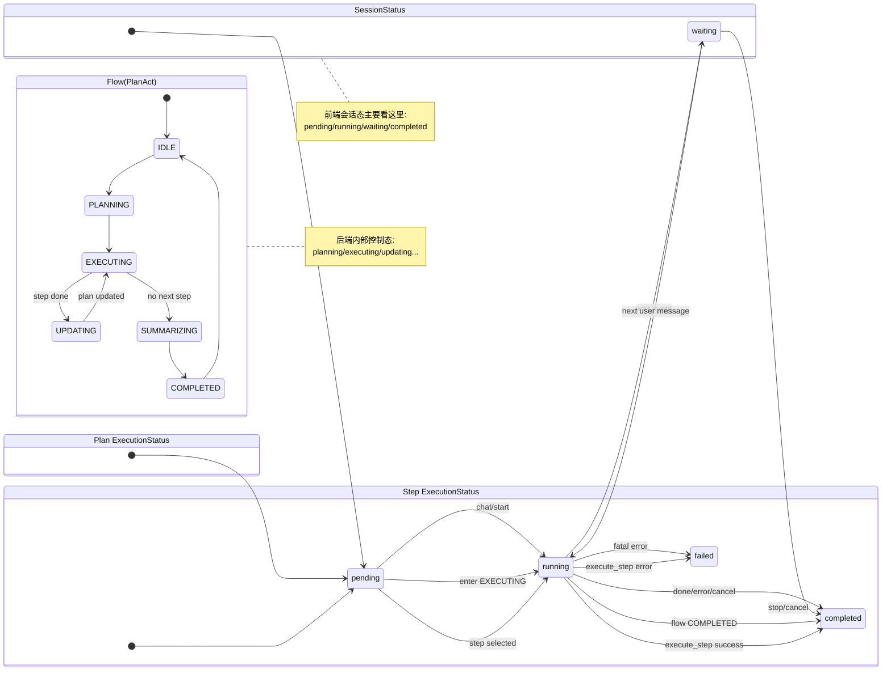
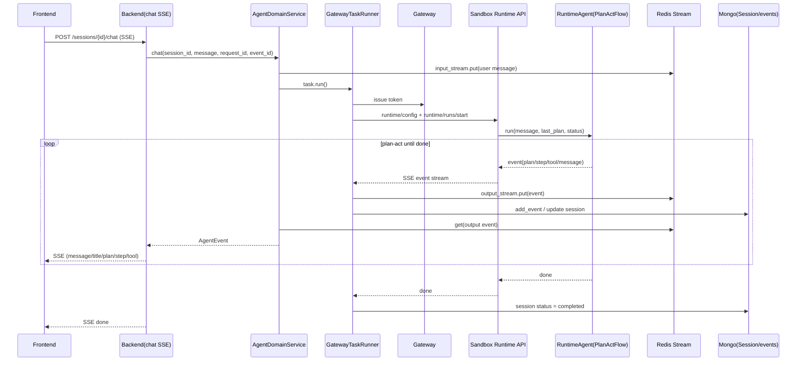
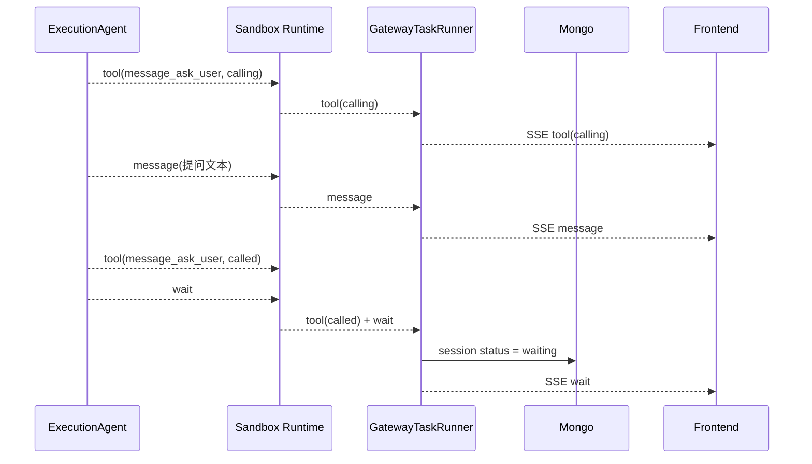
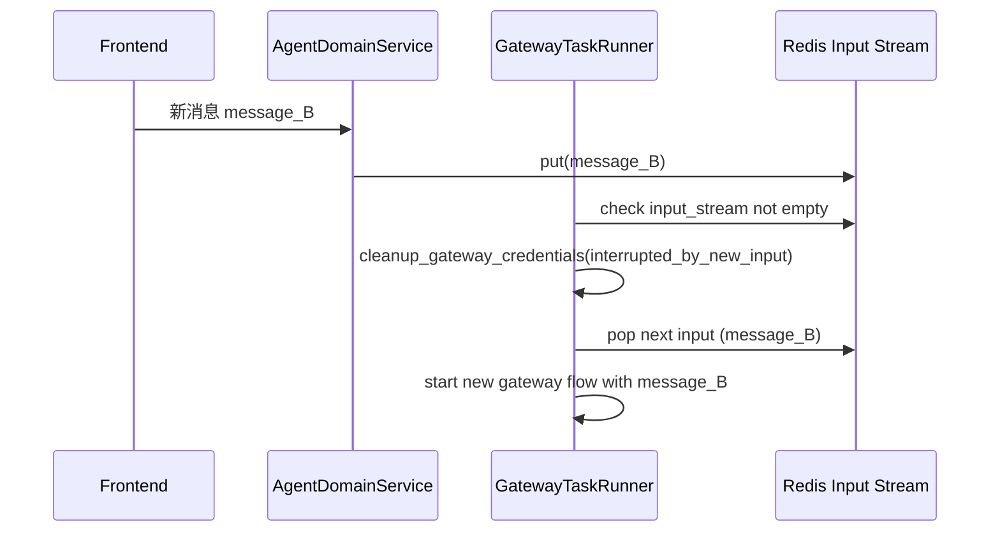

# ai-manus 事件、状态与调用顺序总览

## 1. 目标与范围
本文基于当前代码实现，整理以下三件事：
1. 事件模型：系统里有哪些事件、字段长什么样。
2. 状态体系：会话状态、Flow 状态、步骤状态、工具状态如何流转。
3. 调用顺序：从前端发消息到任务结束（含等待用户、错误、中断）的完整链路。

说明：本文描述的是当前仓库实现，不做额外扩展与兜底。

## 2. 事件模型（AgentEvent）
事件定义（backend/sandbox 一致）：
- `backend/app/domain/models/event.py`
- `sandbox/app/domain/models/event.py`

### 2.1 事件类型
`AgentEvent` 为以下联合类型：
- `message`
- `title`
- `plan`
- `step`
- `tool`
- `wait`
- `done`
- `error`

所有事件都有公共字段：
- `type`
- `id`
- `timestamp`

### 2.2 tool 事件关键字段
`tool` 事件包含：
- `tool_call_id`
- `tool_name`（browser/file/shell/search/message/mcp）
- `function_name`
- `function_args`
- `status`（`calling` / `called`）
- `function_result`（可选）
- `tool_content`（可选，供前端渲染）

前端真正消费的 tool 结构在 SSE 映射后为：
- `name`
- `function`
- `args`
- `content`
- `status`

见：`backend/app/interfaces/schemas/event.py` 中 `ToolEventData` 与 `ToolSSEEvent.from_event_async`。

## 3. 状态体系

## 3.1 会话状态（SessionStatus）
定义：
- `pending`
- `running`
- `waiting`
- `completed`

文件：
- `backend/app/domain/models/session.py`
- `sandbox/app/domain/models/session.py`

主要流转：
- 新会话：`pending`
- 开始执行：`running`
- 触发 `message_ask_user` 并停住：`waiting`
- 执行结束/失败/取消：`completed`

状态更新主逻辑在：`backend/app/domain/services/gateway_task_runner.py`。

## 3.2 Plan / Step / Tool 状态
- PlanStatus：`created` / `updated` / `completed`
- StepStatus（事件态）：`started` / `failed` / `completed`
- ExecutionStatus（计划/步骤执行态）：`pending` / `running` / `completed` / `failed`
- ToolStatus：`calling` / `called`

定义：
- `backend/app/domain/models/event.py`
- `backend/app/domain/models/plan.py`
- sandbox 侧同名文件一致。

## 3.3 Sandbox 内部 Runner 状态（控制平面）
`sandbox/app/services/runtime_run_registry.py` 内部维护：
- 运行中：`starting` / `running`
- 结束态：`completed` / `failed` / `cancelled` / `waiting`
- 过渡态：`cancelling`

这些状态用于 sandbox 内部 run 生命周期，不直接暴露为前端会话状态。

## 3.4 Flow 内部状态（PlanActFlow）
`sandbox/app/domain/services/flows/plan_act.py`：
- `idle`
- `planning`
- `executing`
- `updating`
- `summarizing`
- `completed`

这是 Agent 内部状态机，驱动 plan-act 循环。

## 4. 端到端调用顺序

## 4.1 主链路（用户发消息 -> 执行 -> SSE 回前端）
1. 前端调用 `POST /api/v1/sessions/{session_id}/chat`（SSE）。
2. backend `AgentDomainService.chat()` 校验 `request_id` 幂等并写入 user message 事件到 `input_stream`。
3. 若会话无可用 task，则 `AgentRuntimeFactory -> GatewayAgentRuntime.create_task()` 创建 task，并确保 sandbox 存在。
4. `RedisStreamTask.run()` 启动 `GatewayTaskRunner.run()`。
5. `GatewayTaskRunner`：
   - 向 gateway 申请临时 token；
   - 下发 token 到 sandbox runtime；
   - 调用 sandbox `runtime_start_runner`；
   - 持续消费 sandbox SSE（`runtime_stream_runner_events`）。
6. sandbox 内 `RuntimeRunnerService` 拉起 `RuntimeAgentService.run()`，进入 `PlanActFlow`。
7. Flow 执行中产出 `plan/step/tool/message/...` 事件，写入 sandbox 内 event queue，并通过 SSE 推给 backend。
8. backend 将事件映射为 domain `AgentEvent`，写入：
   - task output stream（Redis Stream）
   - session.events（Mongo 持久化）
9. `AgentDomainService.chat()` 从 output stream 读事件，转成前端 SSE 输出。
10. 前端按 event 渲染中间时间线与右侧工具视图。

## 4.2 Plan-Act 主循环（sandbox 内）
在 `PlanActFlow.run()`：
1. `planning`：Planner 生成计划，发 `title`、`plan(created)`、说明 `message`。
2. `executing`：取下一个 step，发 `step(started)`，交给 Execution 执行。
3. Execution 内部执行工具循环：每次工具调用发 `tool(calling)` -> `tool(called)`。
4. step 完成后发 `step(completed)` + step 结果 `message`。
5. `updating`：Planner 基于执行结果更新计划，发 `plan(updated)`。
6. 重复 2~5，直到无待执行步骤。
7. `summarizing`：总结消息。
8. `plan(completed)` + `done`。

## 4.3 单 Step 内工具调用顺序
在 `BaseAgent.execute()`：
1. 先 ask 模型。
2. 如果返回 tool_calls：
   - 对每个 tool_call 依次发 `tool(calling)`；
   - 调工具；
   - 发 `tool(called)`。
3. 把 tool result 写回上下文再 ask 下一轮。
4. 直到模型不再要求调用工具，发最终 `message`。

## 4.4 `message_ask_user` 特殊分支
在 `ExecutionAgent.execute_step()`：
- 当收到 `tool(message_ask_user, calling)`：先发一条 assistant `message`（提问文本）。
- 当收到 `tool(message_ask_user, called)`：发 `wait` 并立即返回。

backend 收到 `wait` 后：
- 会话状态更新为 `waiting`；
- 清理当前 runtime 凭证；
- 本轮结束，等待用户下一条输入继续。

## 4.5 中断与抢占（新消息到来）
`GatewayTaskRunner.run()` 在处理输出事件时会检查 input_stream：
- 若发现有新的用户输入，会中断当前流并切到下一条输入处理。
- 这是“同会话新消息打断旧执行”的机制。

## 5. SSE 与前端消费

前端主要消费两类 SSE：
1. 会话列表流：`POST /api/v1/sessions`
   - 事件名：`sessions`
   - 用于左侧会话列表刷新（轮询节奏 5s）。
2. 会话事件流：`POST /api/v1/sessions/{session_id}/chat`
   - 事件名：`message/title/plan/step/tool/wait/done/error`
   - 用于中间时间线与右侧工具面板。

补充：
- sandbox 内部 SSE 还有 `heartbeat`，仅用于 backend 保活与拉流控制，不透传前端。
- 前端续传用 `event_id`（Redis Stream ID，如 `1742331234567-0`）作为游标。

事件映射入口：`backend/app/interfaces/schemas/event.py#EventMapper`。

## 6. 持久化与回放

1. 实时队列：
- `task:input:{task_id}`、`task:output:{task_id}` 在 Redis Stream。

2. 持久化历史：
- 会话与事件写入 Mongo（`SessionDocument.events`）。
- 文件元数据写入 `SessionDocument.files`。

3. 截图/文件：
- browser 截图最终落文件存储（GridFS/file storage），SSE 中使用可访问引用。

因此：
- 前端实时靠 SSE；
- 历史回放靠 Mongo 中的事件与文件引用。

## 7. 典型事件序列示例

### 7.1 正常完成
`message(user) -> title -> plan(created) -> step(started) -> tool(calling/called)* -> step(completed) -> plan(updated)* -> ... -> plan(completed) -> done`

### 7.2 等待用户
`... -> tool(message_ask_user, calling) -> message(assistant 提问) -> tool(message_ask_user, called) -> wait`

### 7.3 执行失败
`... -> error`

## 7.4 四层状态联动 Demo（session + flow + plan + step）

示例用户请求：`帮我搜索 OpenClaw，并总结 3 个要点`

### 阶段 A：启动与规划
1. 用户发起 chat 后，会话状态：
- `session.status: pending -> running`
2. Flow 进入规划：
- `flow: IDLE -> PLANNING`
3. Planner 产出计划（假设 3 个步骤）：
- `plan.status = pending`
- `step1/step2/step3.status = pending`
4. 对外事件（SSE）通常会看到：
- `title`
- `plan(created)`
- `message`

### 阶段 B：执行 step1（搜索）
1. Flow 切到执行态：
- `flow: PLANNING -> EXECUTING`
2. 进入 EXECUTING 分支时：
- `plan.status: pending -> running`
3. 取到 step1 执行：
- `step1.status: pending -> running`
- 事件：`step(started)`
4. 调用搜索工具：
- 事件：`tool(calling)` -> `tool(called)`
5. step1 完成：
- `step1.status: running -> completed`
- 事件：`step(completed)` + `message`

### 阶段 C：更新计划并继续
1. Flow 进入更新态：
- `flow: EXECUTING -> UPDATING`
2. Planner 更新后续步骤：
- 事件：`plan(updated)`
3. 回到执行态继续 step2/step3：
- `flow: UPDATING -> EXECUTING`
- `step2/step3` 分别经历 `pending -> running -> completed/failed`

### 阶段 D：收尾完成
1. 无待执行 step 后：
- `flow: EXECUTING -> SUMMARIZING -> COMPLETED`
2. Flow 完成分支里：
- `plan.status: running -> completed`
- 事件：`plan(completed)`、`done`
3. backend 会话收敛：
- `session.status: running -> completed`

### 阶段 E：等待用户分支（message_ask_user）
1. 执行中若触发 `message_ask_user`：
- 事件：`tool(calling)` -> `message(提问)` -> `tool(called)` -> `wait`
2. backend 收到 `wait` 后：
- `session.status: running -> waiting`
3. 用户下一条消息到来后：
- 会话会恢复执行并重新进入 `running`

### 为什么需要这四层状态
1. `session`：会话级生命周期（前端会话列表/可交互态）。
2. `flow`：Agent 内部控制流程（代码分支与循环驱动）。
3. `plan`：任务级执行进度（持久化与回放）。
4. `step`：步骤级执行进度（细粒度追踪与可审计）。

### 7.5 四层状态转移图（单图）

## 8. 关键代码索引
- 事件定义：`backend/app/domain/models/event.py`
- 会话状态：`backend/app/domain/models/session.py`
- 计划/步骤状态：`backend/app/domain/models/plan.py`
- Flow 状态机：`sandbox/app/domain/services/flows/plan_act.py`
- 工具调用循环：`sandbox/app/domain/services/agents/base.py`
- 执行器（含 ask_user/wait）：`sandbox/app/domain/services/agents/execution.py`
- backend runtime runner：`backend/app/domain/services/gateway_task_runner.py`
- backend chat 编排与输出：`backend/app/domain/services/agent_domain_service.py`
- sandbox run 控制：`sandbox/app/services/runtime_runner.py`
- sandbox run 内存队列：`sandbox/app/services/runtime_run_registry.py`
- SSE 映射：`backend/app/interfaces/schemas/event.py`
- API 入口：`backend/app/interfaces/api/session_routes.py`

## 9. 时序图（排障版）

### 9.1 主链路（正常完成）

### 9.2 等待用户分支（message_ask_user）

### 9.3 新消息打断旧执行

