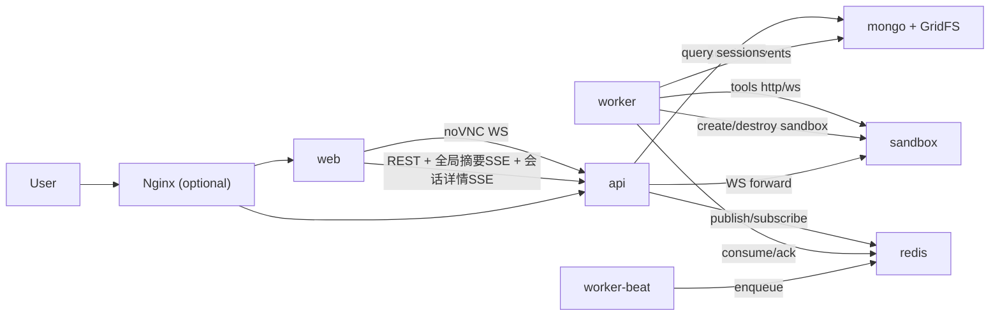

# 多 Agent Backend 改造清单与结构图（MVP）

## 0. 范围边界（已确认）

- 前端继续使用 `ai-manus frontend`。
- 沙箱继续使用 `ai-manus sandbox`。
- 后端重做多 Agent 调度与运行框架。
- 每个 Agent 可绑定独立 LLM 配置（多模型并存）。
- 存储继续使用：`Mongo + Redis + GridFS`。
- 本期不做：`MCP`、`向量数据库`。

---

## 1. 开发清单（按优先级）

### P0（必须先做，形成闭环）

- `Agent Registry`
  - 支持创建/编辑/启停 Agent。
  - 字段：`agent_id`、`name`、`role_prompt`、`tools_policy`、`enabled`。
- `Model Profiles（模型配置中心）`
  - 平台存储多套 LLM 配置：`provider/model/api_base/params`。
  - `api_key` 加密存储（密文 + key_id + 指纹/掩码展示），明文不落库。
  - Agent 在创建/编辑时选择 `model_profile_id`，运行时按绑定档案调用模型。
  - 调用层优先复用 `ai-manus` 现有 LangChain 适配；`nanobot` 仅参考注册表组织思路，不直接复用其实现。
- `Celery Scheduler`
  - `Celery Beat` 按 cron 触发自动任务。
  - 触发后写 `trigger` 记录并投递 `Redis broker`。
- `Execution Queue + Concurrency`
  - broker 承载排队（MVP 固定为 Redis）。
  - 全局并发上限 + 租户并发上限 + Agent 并发上限。
  - 超限保持业务 `pending`，由后续调度补位执行。
- `Session Lifecycle`
  - 状态复用 ai-manus：`pending -> running -> waiting -> completed`。
  - 失败/取消/超时原因通过事件流表达，不新增状态枚举。
  - 每次自动执行直接创建 `source_type=auto` 的 `session`（不新增 `agent_runs` 主实体）。
- `Sandbox Manager`
  - 每个自动任务创建独立 sandbox。
  - 任务结束自动销毁 sandbox。
- `Event Pipeline（实时+回放）`
  - 统一记录：输入、步骤、工具调用、结果、错误、时间戳。
  - SSE 采用双通道：
    - 全局会话摘要流（左侧会话栏常驻订阅）
    - 会话详情流（仅当前打开会话订阅）
  - 历史回放从 Mongo 读取，不依赖 sandbox 存活。
- `Artifact Storage`
  - 截图/文件二进制继续放 GridFS。
  - 会话事件和文件索引元数据放 Mongo。
- `权限最小集`
  - 普通用户仅看授权 Agent 的记录。
  - 管理员看全部。

### P1（MVP 稳定性）

- `Idempotency / Timeout / Reconcile`
  - 幂等去重、执行超时、Celery 状态对账。
- `Lease Protocol`
  - `global/tenant/agent` 三层并发令牌申请与补偿释放。
- `Human-in-the-loop`
  - 支持人工插话继续当前自动会话。
  - 支持人工暂停/恢复自动任务。
- `观测与告警`
  - 基础指标：成功率、平均时长、失败原因 TopN、队列深度、worker 健康。
- `审计日志`
  - 保留关键决策依据与工具参数摘要。

### P2（后续增强）

- Agent 配置管理 UI（后台控制台）。
- 流程模板化（采购、财务、客服等）。
- 经验库与检索增强（后续再评估向量库）。

---

## 2. 数据与组件清单

- 部署服务（MVP）
  - `web`：前端服务
  - `api`：后端 API + SSE + WebSocket 转发
  - `worker`：Celery Worker（执行 Agent Loop）
  - `worker-beat`：Celery Beat（仅定时触发）
  - `sandbox`：ai-manus sandbox
  - `redis`：broker + result backend + 运行态短期数据
  - `mongo`：会话/事件/配置/记忆持久化
  - 说明：MVP 不部署 `ssrf/squid`，后续企业安全阶段再加入。
- Mongo
  - `model_profiles`（LLM 配置档案，含加密密钥字段）
  - `agents`（Agent 定义，含 `model_profile_id`）
  - `agent_groups`（业务分组）
  - `agent_schedules`（cron 配置）
  - `agent_permissions`（Agent 级授权）
  - `agent_triggers`（调度触发记录）
  - `sessions`（会话主记录）
  - `session_events`（操作时间线）
  - `context_checkpoints`（上下文检查点）
  - `agent_memories`（planner/execution 双层记忆）
- GridFS
  - 截图、文件、回放附件（二进制）
- Redis
  - Celery broker/result backend（MVP 固定 Redis）
  - 并发令牌、上下文热态、SSE fanout 缓冲

---

## 3. 结构图（MVP）

---

## 4. 关键执行链路

1. `Beat` 到点触发，创建 `trigger` 并生成自动 `session_id`（`source_type=auto`）。
2. 任务投递到 broker，等待 worker 消费。
3. worker 开始执行前检查并发令牌；超限则回写业务 `pending`。
4. worker 领到任务后创建独立 sandbox。
5. Agent 按自身 `model_profile_id` 绑定的模型档案调用 LLM，执行 browser/shell/file 工具。
6. 事件实时通过 SSE 推前端，同时写入 Mongo；截图/文件写入 GridFS。
   - 自动调度任务即使非用户主动发起，也会通过全局摘要流推送到在线前端。
7. 上下文采用 `planner/execution` 双层记忆，浏览器内容先剪裁再入 LLM。
8. 任务完成后自动销毁 sandbox。
9. 历史回放通过 Mongo + GridFS 读取，不依赖 sandbox 存活。

---

## 5. 验收口径（MVP）

- 同时配置多个 Agent 且使用不同模型执行成功。
- 自动任务可按 cron 触发，超并发任务保持 `pending` 并自动恢复执行。
- 每次自动任务创建独立 sandbox，完成后销毁。
- 前端可实时查看操作流；任务结束后可完整回放。
- 停掉 sandbox 后，历史仍可查看。

## 6. 关联文档

- 详细部署拓扑与部署规则见：
  - [15-deployment-topology.md](/Users/zuos/code/github/ai-manus/md/modules/15-deployment-topology.md)
