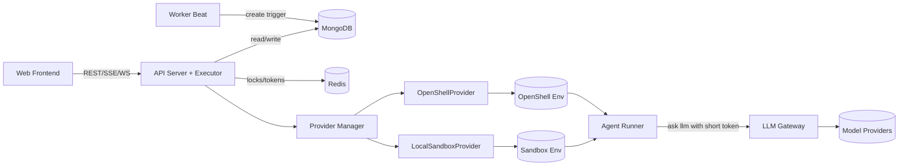

# Provider 方案文档（provider_md）

## 0. 文档目标
- 统一 `Agent 执行面` Provider 抽象，支持：
  - 当前 `ai-manus sandbox`（优先落地）
  - 后续 `OpenShell`（可插拔扩展）
- 保持前端协议兼容：会话、SSE、noVNC、shell/file 回放不推翻。
- 架构原则：**设计解耦、职责清晰、流程闭环**。

## 1. 核心决策
1. 控制面与执行面分离
- 控制面：`api(含执行器) + worker-beat + gateway`
- 执行面：`sandbox 内 runner`

2. 每次运行绑定独立执行环境
- `一次任务运行 = 一个 session = 一个 sandbox env`
- 结束后销毁 sandbox；历史由 `mongo/gridfs` 回放。

3. Provider 统一抽象
- `ExecutorProvider` 屏蔽底层差异，一期 `LocalSandboxProvider`，二期 `OpenShellProvider`。

4. LLM 必须经 Gateway
- runner 禁止直连模型厂商。
- runner 仅调用 `LLM Gateway`，由 gateway 注入真实密钥并路由。

## 2. 架构方案

## 2.1 逻辑架构

## 2.2 自动任务时序
1. `worker-beat` 读取 `task_schedules` 到点创建 trigger。
2. `api executor` 认领 pending trigger，创建 `source_type=auto` session。
3. `ProviderManager.create_env()` 分配执行环境，返回 `env_id`。
4. 在 env 启动 `agent-runner`，开始 plan/exec/tool loop。
5. `api executor` 签发短时 `llm_token`（绑定 `tenant/env/run`）给 runner。
6. runner 调用 gateway 推理并持续上报事件。
7. `api` 持久化事件到 mongo，并通过 SSE 推给前端。
8. 结束后 `destroy_env()`，会话收敛为 `completed|failed|cancelled`。

## 2.3 人工介入时序
1. 用户在会话页发送消息或接管 noVNC。
2. `api` 直接将输入转发给对应 env 内 runner。
3. 若 env 已销毁：先 `create_env`，恢复上下文后继续。
4. 恢复时重新签发 token，旧 token 立即失效。

## 3. 关键约束

## 3.1 Gateway 地址下发（冻结）
创建 sandbox 时由控制面动态注入：
- `GATEWAY_BASE_URL`
- `GATEWAY_TOKEN`
- `GATEWAY_TOKEN_EXPIRE_AT`

限制：
- runner 只读上述配置。
- 会话消息不得覆盖 gateway 地址。
- sandbox 重建必须重新下发地址与 token。

## 3.2 Token 生命周期（冻结）
1. 签发：api executor 在 run 启动时调用 `gateway /token/issue`
2. 轮换：重建/恢复/临近过期时重新签发
3. 吊销：run 完成/取消/超时后 `gateway /token/revoke`
4. 强绑定：`tenant_id/env_id/run_id`

## 3.3 网络策略（冻结）
- 浏览器进程允许访问外部业务网站。
- runner/脚本进程仅允许访问内部 gateway。
- runner 直连模型厂商域名必须失败。

## 4. 部署拓扑（一期）
- `web`
- `api`（含 executor）
- `worker-beat`
- `gateway`
- `sandbox`
- `redis`
- `mongo`

## 5. 任务开发清单
## M0 契约冻结
- 冻结 `ExecutorProvider` 接口
- 冻结 session/event 字段
- 冻结错误码（provider/env/run）

## M1 控制面重构
- `api` 接入 `ProviderManager + RunOrchestrator`
- 内置执行器（认领 trigger、并发令牌、状态机收敛）
- 保持手动会话链路兼容

## M2 Gateway 服务
- `ask/stream + issue/revoke/verify`
- 限流、熔断、策略过滤、多模型路由
- 请求审计落库 `llm_gateway_requests`

## M3 LocalSandboxProvider
- `create_env/destroy_env/start_run/cancel_run`
- file/shell/browser/vnc 适配
- 事件 seq 幂等

## M4 Env Runner
- 启动器、健康探针、心跳
- 上下文恢复
- 严禁直连模型厂商

## M5 实时与回放
- 事件落库 + SSE 推送
- 断线重连补拉（`from_event_id`）
- noVNC 映射重建后重绑

## M6 安全与审计
- token 全链路吊销与过期治理
- 关键动作审计
- egress 合规检查

## 6. 验收要点
1. 自动触发、手动触发、介入、取消、超时全部闭环。
2. `session` 状态与 `trigger` 状态一致。
3. runner 崩溃、api 重启后能收敛，不出现悬挂 run。
4. 无明文密钥，runner 直连模型域名失败。
5. 前端会话、SSE、noVNC 协议保持兼容。
